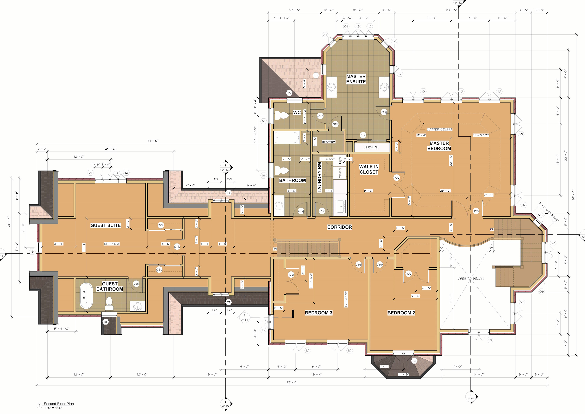

Here's a few shots of my final project for a Revit 2 class at George Brown College. The task was to build up a Manor House over two semesters and show:

1. Rendered scenes of the house
1. Site plan and floor plans, roof plans
1. Elevations
1. Sections

## Renders, Elevation

## Plans

## Sections

