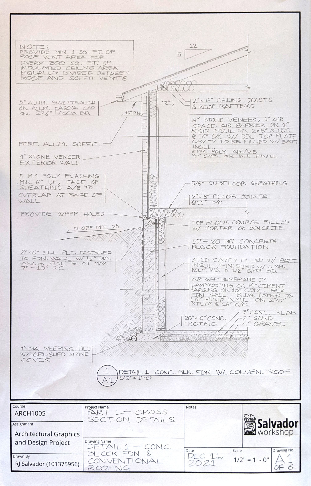
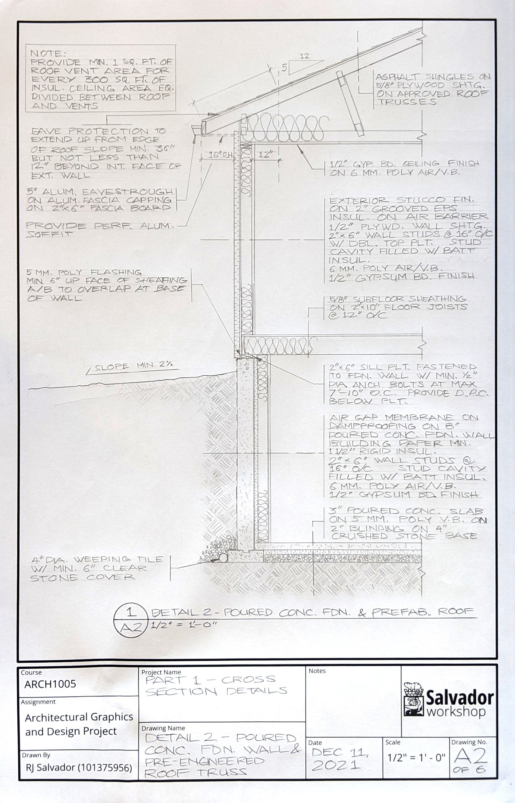
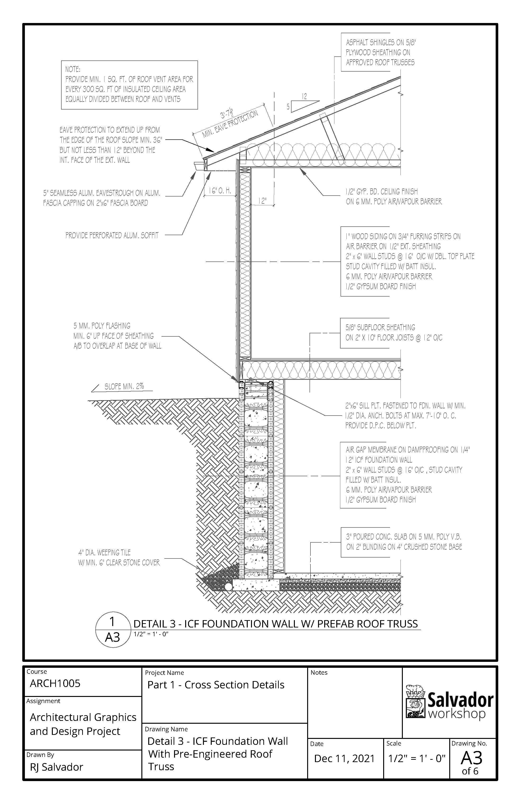
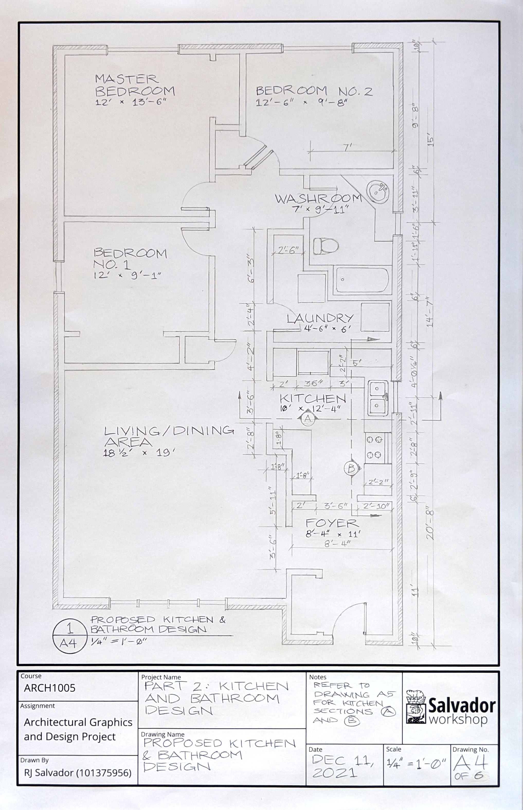
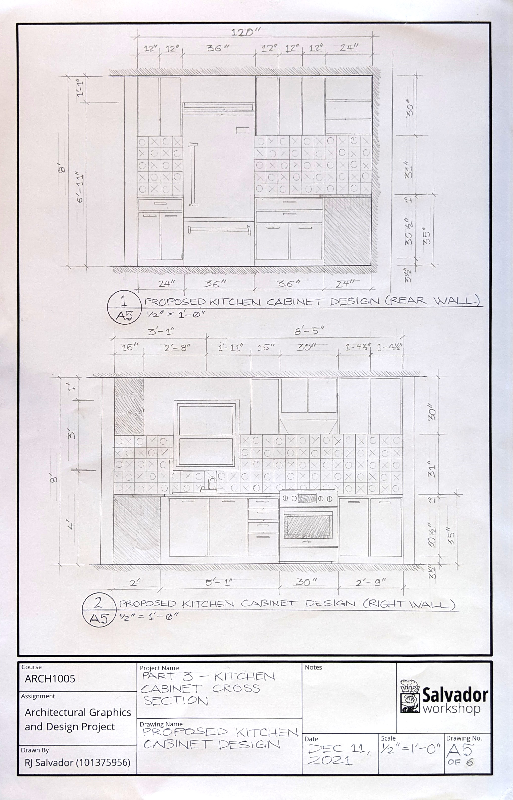

This was my final project for my first semester Studio class at George Brown College. The task was to draft:

1. Typical wall sections, as constructed in Ontario
1. Kitchen/Bathroom design (plan), working with a pre-determined envelope and bedrooms
1. Kitchen cabinet design (elevations)

All sheets are tabloid sized (17" x 11"), with my title blocks done in AutoCAD.

## Wall Sections

## Kitchen/Bathroom Plan

## Kitchen Elevations/Sections

