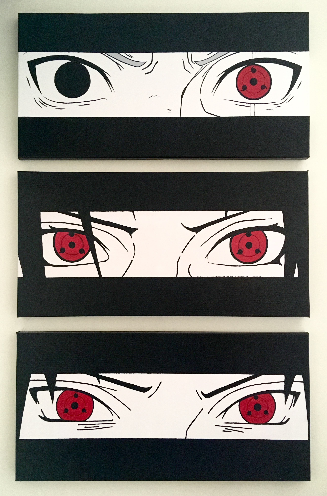
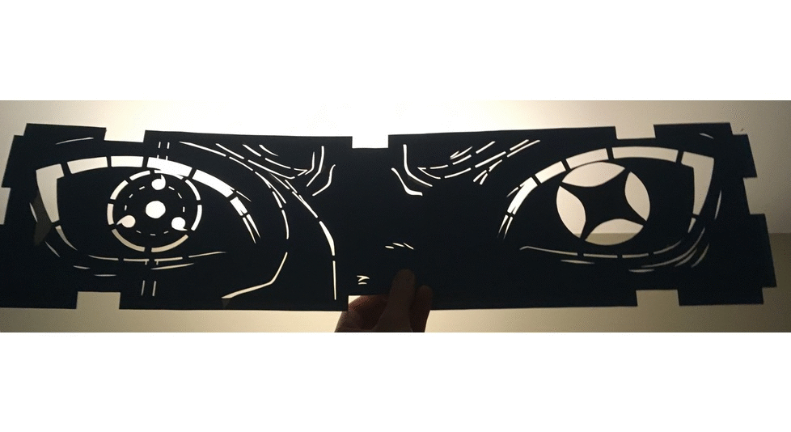
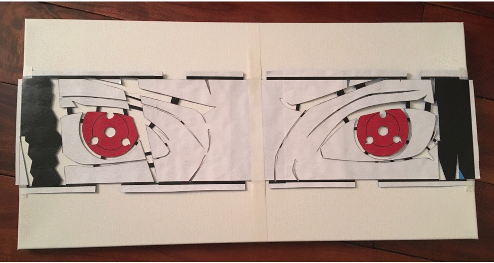
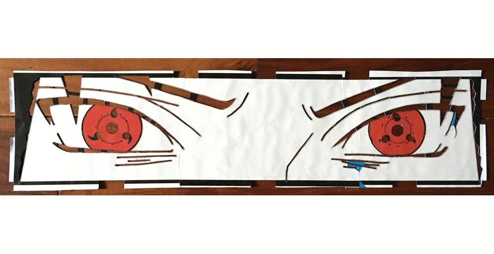

This painting series was inspired by the Naruto marathon I watched a few months ago.

## Materials/media

They're all acrylic on canvas (24" x 12"), finished with semi-gloss varnish.

1. Poster board
1. X-acto knife
1. Canvas
1. Acrylic paint
1. Acrylic varnish

## The Process

1. Make stencil using printed manga panels
1. Put down paint using the stencil
1. Clean up the messy stencil job, refine details
1. Fill in the eyes
1. Clean up mistakes
1. Varnish (2 to 3 coats)

