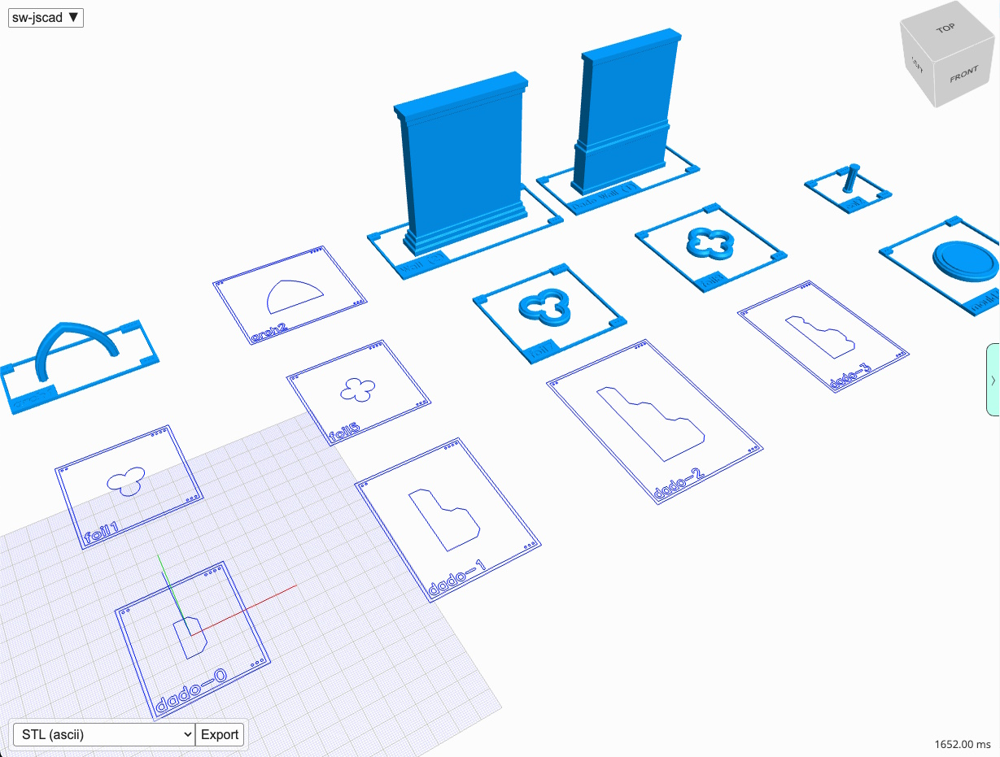
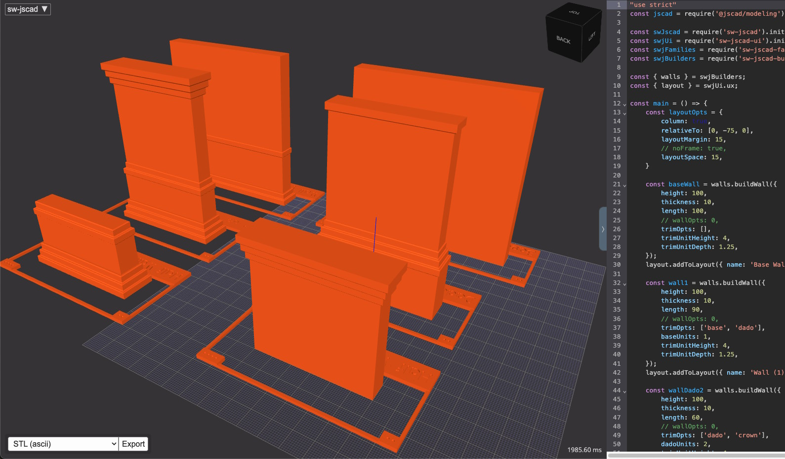
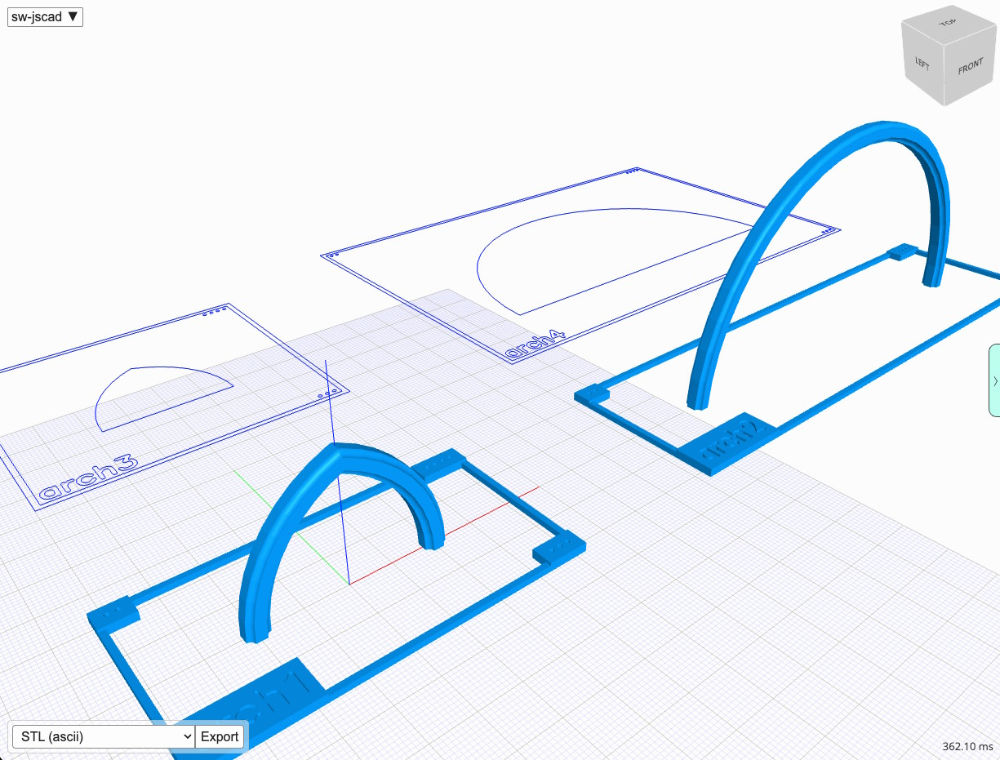
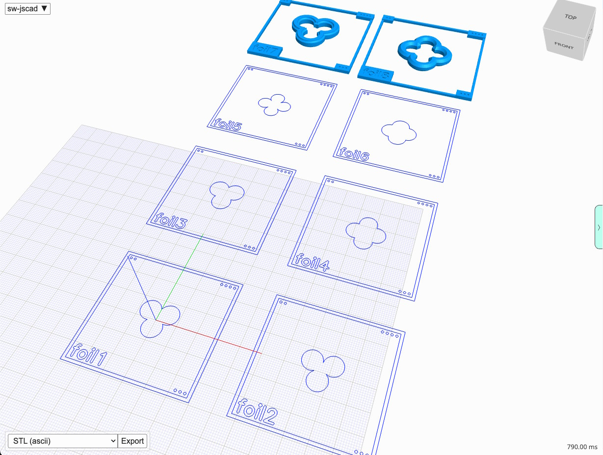
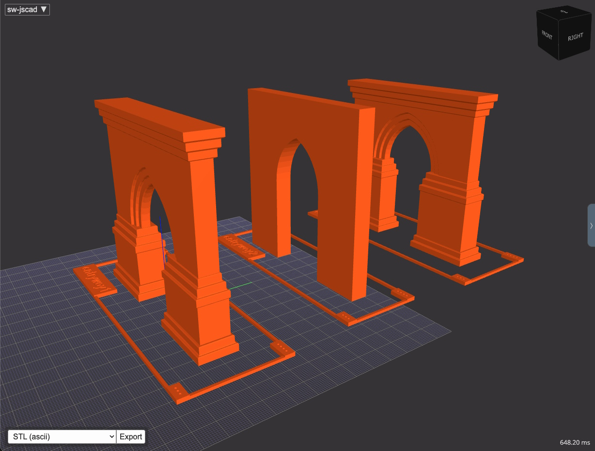
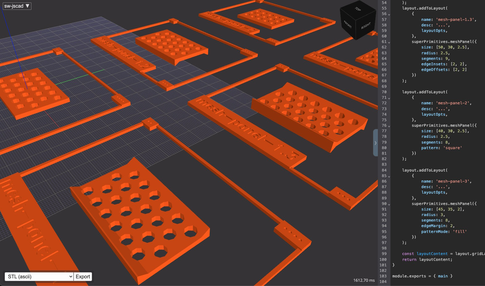
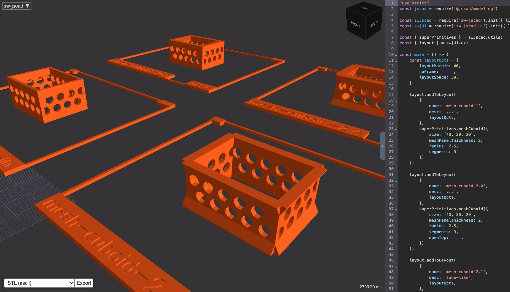
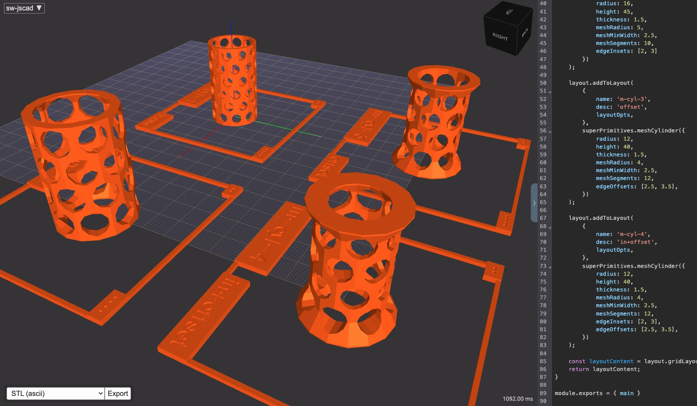
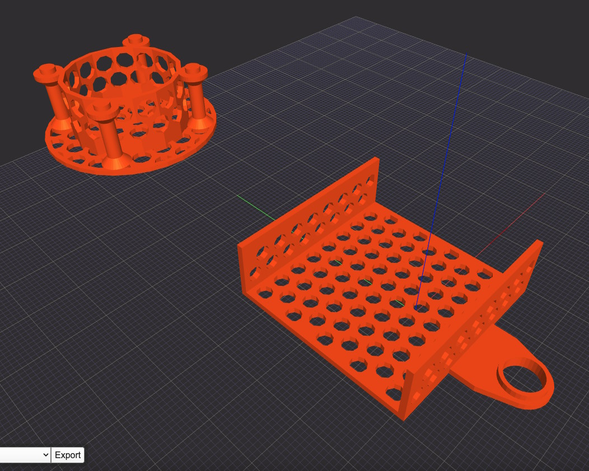
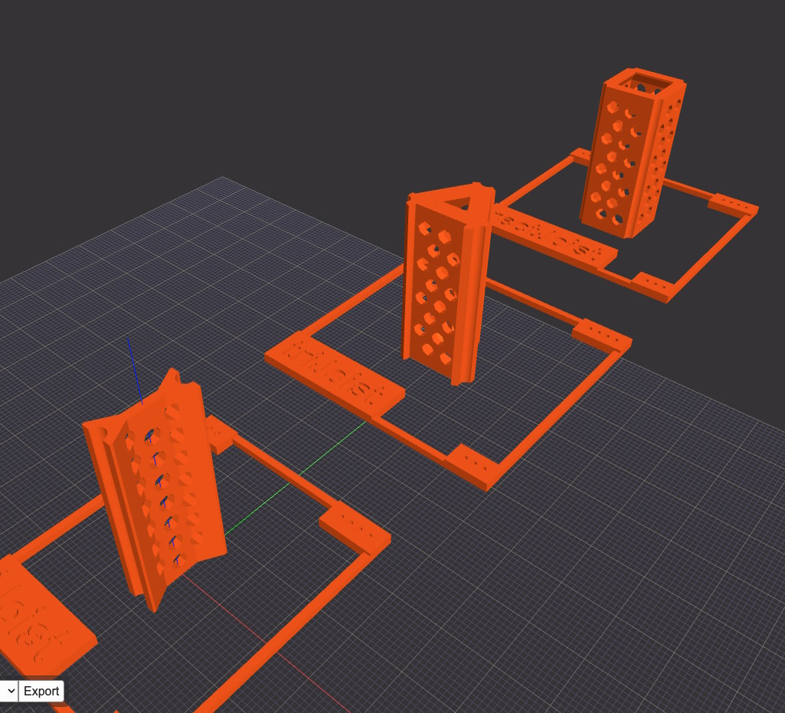

`sw-jscad` is a JavaScript library by Salvador Workshop that extends `jscad` for creating parametric 2D and 3D CAD designs with JavaScript code.

I started writing this library in the start of 2025, and found it to be a great way to design 3D models for my new 3d printer.
But more importantly, this project allowed me to learn about developing a library for public consumption. And it gave me a
tiny glimpse into the design decisions library designers and maintainers have to make regularly.  

## Tech

### Key Stats

_Core technologies:&nbsp; npm, 3D Modeling, CAD/CAM Software, Open Source Development_  
Online viewer: [sw-jscad-viewer.netlify.app/](https://sw-jscad-viewer.netlify.app/)  
API Docs: [salvador-workshop.github.io/sw-jscad/](https://salvador-workshop.github.io/sw-jscad/)  
NPM package: [npmjs.com/package/sw-jscad](https://www.npmjs.com/package/sw-jscad)  
GitHub: [github.com/salvador-workshop/sw-jscad](https://github.com/salvador-workshop/sw-jscad)  

### Design

The toolkit is composed of several packages, arranged in a layered architecture.

### Core packages

The _core packages_ power everything

| Package | Description |
| --- | --- |
| sw-jscad | JSCAD library for parametric modelling of architectural components |
| sw-jscad-families | Designs groups of related models |
| sw-jscad-std-specs | Definitions for building elements and various standards/specs |
| sw-jscad-ui | UX, layouts, etc |

### Sub packages

The _sub packages_ build larger and more complicated components using the core packages as building blocks.

| Package | Description |
| --- | --- |
| sw-jscad-builders | Tools and functions for building assemblies |
| sw-jscad-factory | Doesn't exist yet. For larger and more complicated assemblies, compared to the `builders` package |

## Models & Functions

The library can output 2D and 3D designs of things like:

- arches (1-pt and 2-pt for now)
- foils (like trefoils, quatrefoils)
- walls
- roofs

and a variety of other functions that make JSCAD modelling easier

Here's a small sample of model types:

### Walls

`sw-jscad`'s wall builder has several options for base/dado/crown moulding. 
The dado ornamentation respects changes in thickness between the lower and upper portions of the wall.
The height of the thickness change can be specified as well.

### Arches, Foils

One-point(circular) and Two-point (gothic) arches

2D and 3D foil designs

### Entryways

Entryways combine a wall with an arched opening, in this case a gothic arch.
The builder ensures a smooth transition no matter what moulding choices and wall
options were made.

### Mesh primitives (panel, cuboid, cylinder)

Panels with configurable mesh pattern:

Cuboid built with said panels:

Cylinder with similar ideas

### Misc

Here I'm designing a pegboard-to-surface mount and something similar for mounting something under a floor joist

A more advanced idea - creating joists using dowels:

