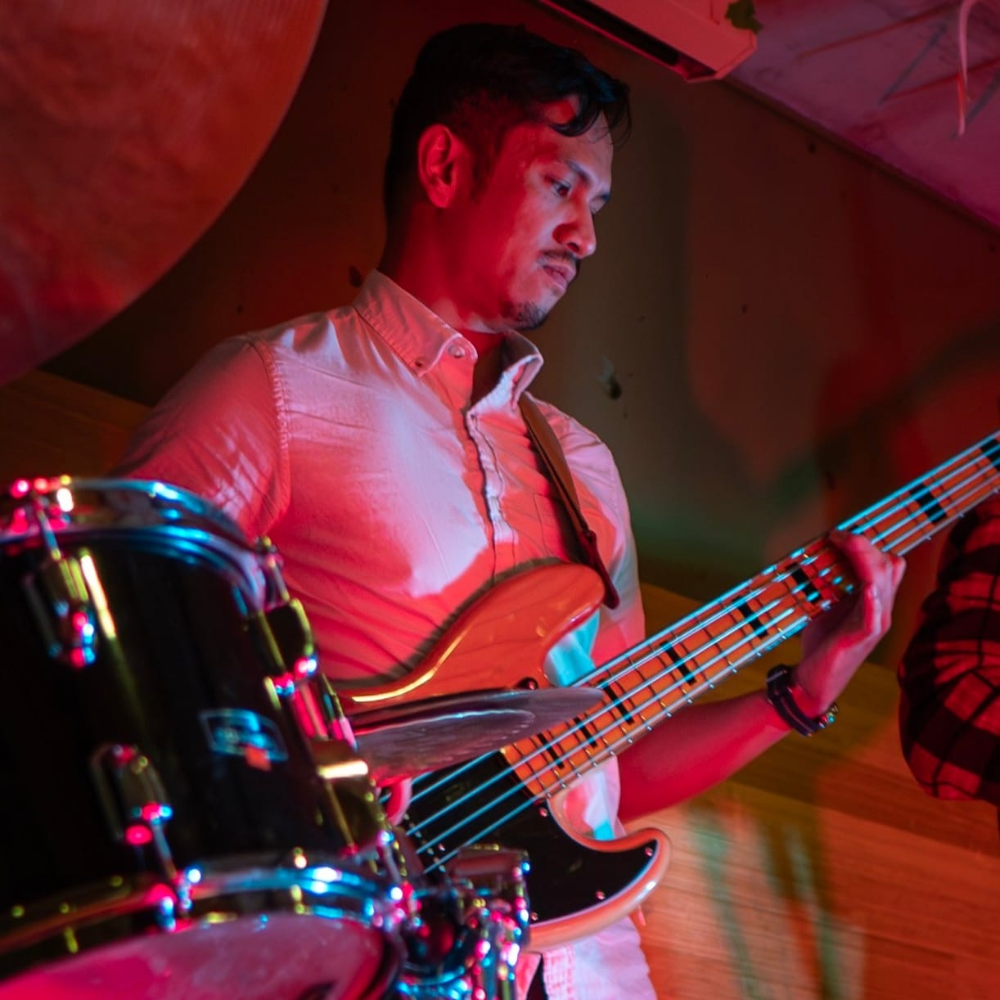

# About Me

Hi, my name is RJ and a software engineer based in Toronto, Canada. Having worked in web development since 2014, I've learned how to use several technologies to tackle issues across tech stacks. As my career progressed, I developed a focus on the front-end, UI/UX, data visualization, and 3D modeling. More recently, I've worked with complex data visualizations in a research project (Uncharted Software) and 2D/3D construction estimation (Autodesk Construction Solutions).

Nowdays, I'm setting my sights on emerging digital tools in AEC (Architecture, Engineering, Construction). Historically, my family has strong ties in this line of work. My grandfather was an aircraft mechanic, and one of his cousins founded a construction company. My father designed my childhood home and my great-uncle's company built it. Unsurprisingly, I've always had an interest in architecture, and I finally took college courses for Architecture Tech during the pandemic. I hope to leverage tech to sustainably improve the built environment, while making life easier for the people building it.

When I'm away from work, I'm usually playing music or hanging out at a climbing gym. I'm an avid musician and love playing guitar (flamenco), bass (jazz/rnb), and cello (classical). My tunes can be found on Instagram at [@salvadorrjams](https://www.instagram.com/salvadorrjams/)
